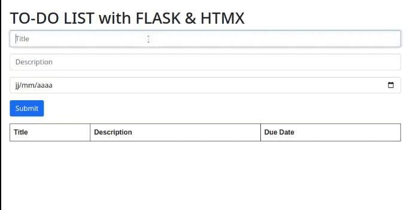

## Flask and HTMx Example

  

This is a basic, rough and ready demo of integrating [Flask](https://flask.palletsprojects.com/) and [HTMx](https://htmx.org/) into a single page application.

### Install & Usage
1. Clone the repo:
    ```
    git clone https://github.com/ju-c/flask-htmx-example.git
    ```

2. Move to the base directory:
    ```
    cd flask-htmx-example
    ```
    
3. Create a new python environment:
    ```
    python -m venv env
    ```

4. Activate environment:  

    - On Windows:
        ```
        env\Scripts\activate
        ```

    - On Linux and Mac:
        ```
        source env/bin/activate
        ```

5. Install the requirements:
    ```bash
    pip install -r requirements.txt
    ``` 

6. Run the server:
    ```
    python run.py
    ```
